# Traffic-Management-System
Control traffic lights based on the vehicle density at four regions of interest at a traffic intersection. Live video stream obtained from here.

---

#### Background Extraction

Calculate the weighted sum of the input image src and the accumulator dst so that dst becomes a running average of the frame sequence. [link](https://docs.opencv.org/2.4/modules/imgproc/doc/motion_analysis_and_object_tracking.html?highlight=accumulate#accumulateweighted)

---

Average Image

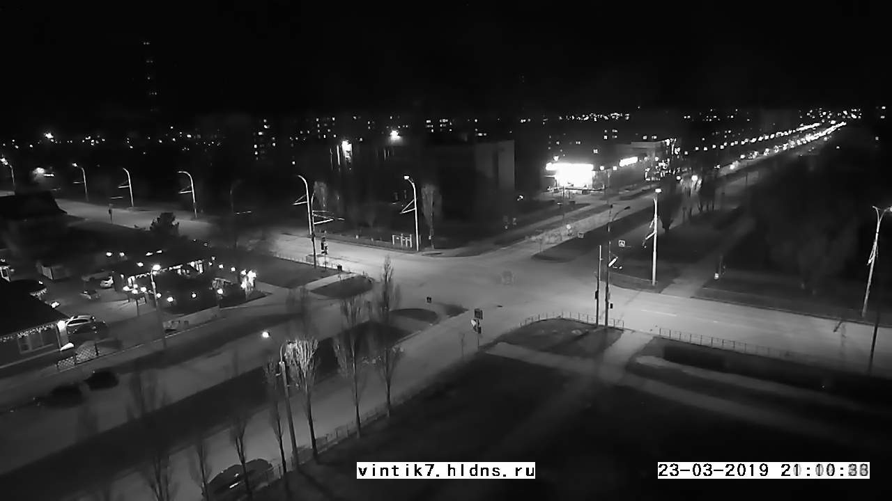

---

#### Template Creation
with masks and average frame [cv2.bitwise_and()](https://docs.opencv.org/2.4.8/modules/core/doc/operations_on_arrays.html#bitwise-and)

Template 1|  Template 2|Template 3|Template 4
----|-------|---------|---------
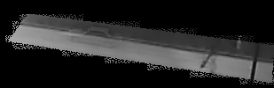 | 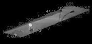 | 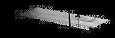 | 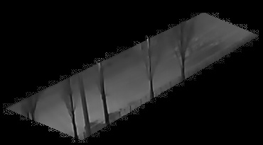

---

#### ROI Extraction

ROI 1|  ROI 2|ROI 3|ROI 4
----|-------|---------|---------
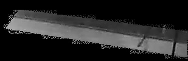 | 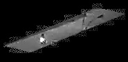 | 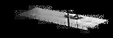 | 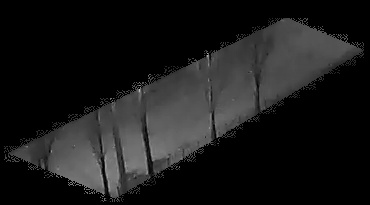

---

#### Template Matching

ROI 1|  ROI 2|ROI 3|ROI 4
----|-------|---------|---------
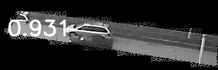 | 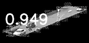 | 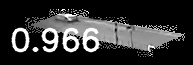 | 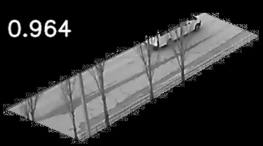

refer [TMS.ipynb](https://github.com/4lhc/Traffic-Management-System/blob/master/TMS.ipynb) for more.
